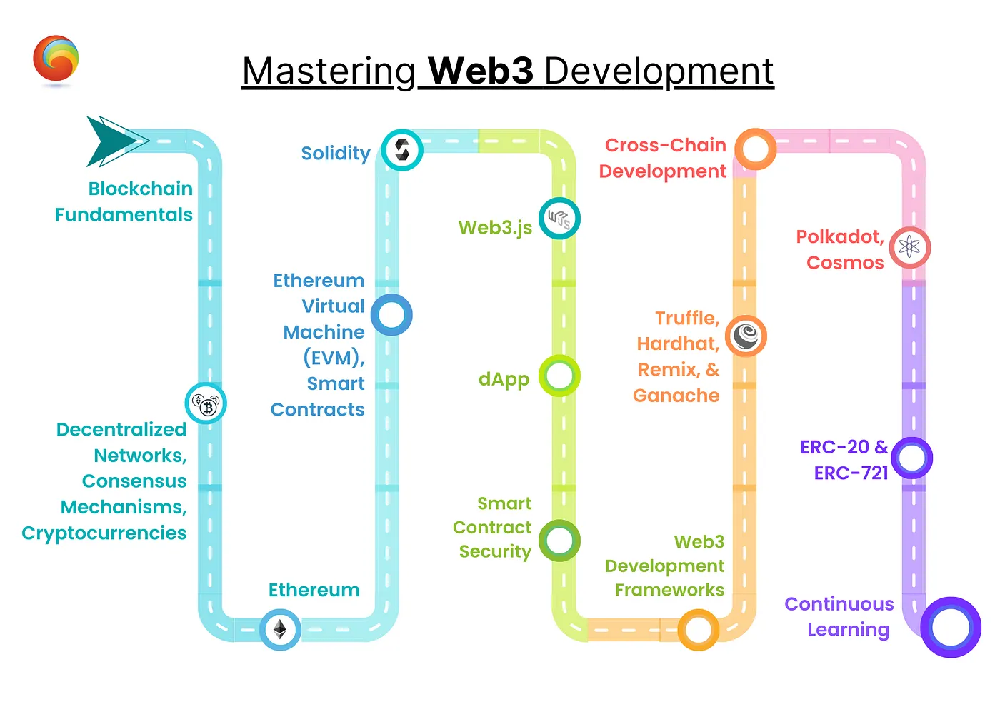

# Web3 Roadmap

从0到1记录web2程序员如何转型web3开发。本文包含基础知识，以及各种项目实践，素材均来自互联网。学习过程中收集的学习资料和视频资料，会一并贴出，并附上笔记和理解，不做任何投资建议，仅提供网上收集到的各种web3学习资料，欢迎感兴趣的同学一起讨论交流学习

### 前言

为什么要做这个笔记&&为什么想要走这条赛道 刚接触发现这个赛道的知识点真是茫茫多，无从下手，记录一下，自己从0到1以及到达成最终成就“web3数字游民”需要耗费多长时间【在职状态】，给观望的同学们探探路。 至于为什么选这个赛道,2022年年末的寒气不出意外的吹到了2024，经济倒退的环境下，只能自己主动求变了，换个赛道maybe会好一点。并且即将成为大龄程序员，希望未来可以做到生活工作平衡，有时间可以陪陪家人，诸多原因导致我打算all-in，web3。加油吧！

### 路线图


本文主要基于此路线图


<figure><figcaption></figcaption></figure>

### 什么是Web3

* [区块链的基础知识](ji-chu-zhi-shi/qu-kuai-lian-de-ji-chu-zhi-shi.md)
* [web3的基础知识](shi-mo-shi-web3/web3fundamentals.md)

### 智能合约

* [Page 1](broken-reference)
